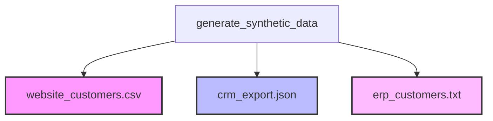

# Data Utilities: Synthetic Customer Data Generator

Welcome to the team! This directory contains core utilities for generating synthetic customer datasets. 

This guide serves as a detailed reference for junior engineers and trainees to understand the high-level concepts, architectural design, and implementation details of the synthetic data generator in `__init__.py`.

---

## 📖 Table of Contents
1. [Core Data Engineering Concepts](#-core-data-engineering-concepts)
2. [Data Quality Issues Simulated](#-data-quality-issues-simulated)
3. [Source Formats Generated](#-source-formats-generated)
4. [Line-by-Line Code Breakdown](#-line-by-line-code-breakdown)
5. [The Pandas Version Trap (Troubleshooting)](#-the-pandas-version-trap-troubleshooting)

---

## 🧠 Core Data Engineering Concepts

In production environments, we rarely test downstream pipelines on real client data due to security, privacy (GDPR/CCPA), and volatility concerns. Instead, we use synthetic data generators.

This utility implements three fundamental data engineering concepts:
* **Garbage In, Garbage Out (GIGO):** A pipeline is only as good as its cleaning layer. We intentionally inject errors (malformed emails, mixed casings, empty values) to test if our pipelines clean them or crash under pressure.
* **Ingestion Heterogeneity:** Real-world enterprise ecosystems store data in multiple, disparate systems. We generate CSVs, JSON, and Fixed-Width Text files to prepare you for diverse ingestion protocols.
* **Deterministic Randomness:** We use seeds to ensure that the "random" data generated is identical on every run. This is essential for debugging and writing consistent unit tests.

---

## ⚠️ Data Quality Issues Simulated

The generator populates the raw data directory with common real-world data issues:
* **Inconsistent Categorical Values:** Region entries are randomized as `"US"`, `"us"`, `"USA"`, `"united states"`, `"North America"`, or missing (`None`, `""`, `"N/A"`). A cleaning layer must standardize these to canonical keys (`US`, `EU`, `APAC`).
* **Non-Standard Phone Formatting:** Phones use mixed structures (`+1 (555) 123-4567`, `555.123.4567`, `5551234567`, etc.) and garbage values (`"invalid-phone"`).
* **Malformed Email Syntax:** Includes syntax violations such as `not-an-email`, `missing@`, `@nodomain.com`, and `double@@sign.com`.
* **Internal/Test Pollution:** Simulates test accounts (e.g., `test0@test.shopstream.com`). Downstream metrics must filter these out to avoid reporting false operational KPIs.

---

## 🗂️ Source Formats Generated

The script generates **three distinct data formats** in the raw directory:



### 1. Website CSV (`website_customers.csv`)
* **Encoding:** Latin-1 (`iso-8859-1`) instead of UTF-8. 
* **Challenge:** Supports accented characters (e.g. `André`, `José`, `Müller`). Failing to open the file with the proper encoding parameters in your reader will trigger `UnicodeDecodeError` crashes.

### 2. CRM API Export (`crm_export.json`)
* **Encoding:** Standard UTF-8.
* **Structure:** Nested key-value records representing REST API returns:
  ```json
  {
    "customers": [
      {
        "id": "CRM-000000",
        "email": "customer12@gmail.com",
        "profile": {
          "first_name": "Maria",
          "last_name": "Smith"
        },
        "lifetime_value": 420.50
      }
    ]
  }
  ```
* **Challenge:** The pipeline must parse nested properties (`profile.first_name`) into a flat tabular format.

### 3. ERP Mainframe Export (`erp_customers.txt`)
* **Format:** Fixed-Width Text.
* **Challenge:** There are no column delimiters (like commas or tabs). Columns are mapped to exact character ranges. 
  * Character `0-10`: Customer ID (Right-aligned, padded)
  * Character `10-60`: Customer Full Name (Left-aligned, padded)
  * Character `60-120`: Email (Left-aligned, padded)
  * Character `120-140`: Phone
  * Character `140-145`: Region
  * Character `145-155`: Registration Date
  * Character `155-160`: Status Code (`ACTIV` or `INACT`)

---

## 🔍 Line-by-Line Code Breakdown

### 1. Header & Path Manipulation
```python
project_root = Path(__file__).resolve().parent.parent.parent
if str(project_root) not in sys.path:
    sys.path.insert(0, str(project_root))
```
* Walk up three directory layers from `data/utils/__init__.py` to locate the project root directory.
* Append the root folder dynamically to Python's look-up list (`sys.path`) so that importing project-wide files like `config.py` does not throw a `ModuleNotFoundError`.

### 2. Logging Configuration
```python
logging.basicConfig(
    level=logging.INFO,
    format="%(asctime)s - %(name)s - %(levelname)s - %(message)s",
    handlers=[
        logging.FileHandler(log_path),
        logging.StreamHandler(),
    ],
)
```
* **`level`**: Captures messages marked `INFO` and higher (ignores verbose `DEBUG` logs).
* **`handlers`**: Writes logs to `logs/pipeline.log` (for audit trails) while printing them to the terminal console (for live feedback).

### 3. Reproducible Seed Selection
```python
np.random.seed(42)
```
* Initiates Numpy's pseudo-random generation with a constant starting point. Any random shuffling or choosing done under this execution will be perfectly identical across different machines.

### 4. Constructing Fixed-Width Fields
```python
line = (
    f"{str(i):>10}"
    f"{name:<50}"
    f"{email:<60}"
    ...
)
```
* **`>`** indicates right-alignment, padding fields with spaces on the left to fit the designated size.
* **`<`** indicates left-alignment, padding fields with spaces on the right to fit the designated size.

---

## ⚡ The Pandas Version Trap (Troubleshooting)

When running the utility, you might encounter a crash:
```text
ValueError: Invalid frequency: H. Did you mean h?
```
* **The Root Cause:** In standard Pandas releases, the offset alias for hour was historically `H` (e.g. `freq="4H"`). In Pandas 2.2.0+, uppercase aliases were officially deprecated and deleted. Using `"4H"` in modern versions throws a `ValueError`.
* **The Fix:** Ensure line 73 in `__init__.py` uses lowercase `"4h"`:
  ```python
  "Registration Date": pd.date_range("2020-01-01", periods=n, freq="4h").strftime("%Y-%m-%d"),
  ```
  *(If running older pre-2.0 environments, reverse this change to `"4H"`).*
